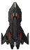
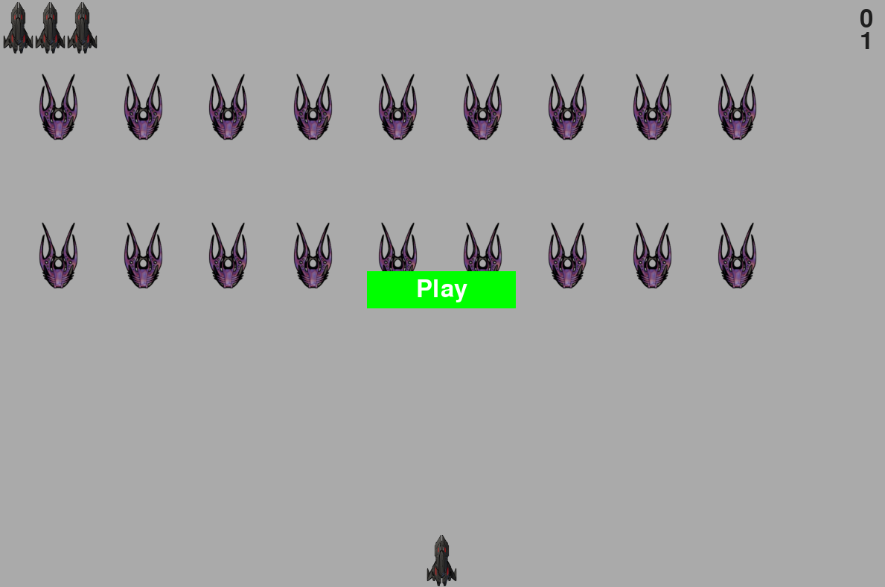

<!-- HEADER -->
<br />
<div align="center">
    

  <h3 align="center">Alien Invasion</h3>

  <p align="center">
    Pygame Space Invaders
  </p>
</div>

<!-- ABOUT -->
## About



This is an arcade game similar to Space Invaders written in Python.

### Built With

* [Python](https://www.python.org/)
* [Pygame](https://www.pygame.org/news)

<!-- GETTING STARTED -->
## Getting Started

### Prerequisites

None. But if you receive any errors, you may need to ensure Pygame is installed.

  ```sh
  pip install pygame
  ```

### Installation

1. Clone the repo
2. Run alien_invasion.py

<!-- USAGE EXAMPLES -->
## Usage

**Controls**
- Press PLAY to start the game. 
- Left and right arrows to move your ship.
- SPACEBAR to shoot.
- "Q" to quit.

<!-- CONTRIBUTING -->
## Contributing

Any contributions you make are **greatly appreciated**.

If you have a suggestion that would make this better, please fork the repo and create a pull request.

1. Fork the Project
2. Create your Feature Branch (`git checkout -b feature/MyGreatFeatureRequest`)
3. Commit your Changes (`git commit -m 'Add some features'`)
4. Push to the Branch (`git push origin feature/MyGreatFeatureRequest`)
5. Open a Pull Request

<!-- LICENSE -->
## License

Distributed under the GPLv3 License. See `LICENSE` for more information.

<p align="right">(<a href="#top">back to top</a>)</p>